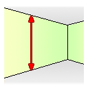

Measure this room
==
*a web browser extension for real estate websites* [download now](https://github.com/AmadeusW/measure/releases/download/0%2C2/measure.0.2.crx)

When looking to rent or purchase a property, it is important to find one where you can live comfortably, whether you are a tall person or don't like confined spaces.

Often, real estate photos are taken with wide angle lenses that distort the size of the rooms. Upon visitng such place, you may find that the ceilings are too low for your liking, ultimately wasting your time. Is there a way to tell height of a room before making a trip to see it?

This extension will use the relative size of the wall feature with respect to the entirety of the wall to estimate the height of the room. 

1. Find a photo that has an electrical socket or other feature of known size on a wall. 
2. Right click on the photo and select "measure this room".
3. Click on the top and bottom edges of the wall feature. 
4. Click on edges where the wall meets the ceiling and the floor. 
5. After these four clicks, the extensions will estimate the size of the room. 
6. Click on the photo again to start over.

One of the sources of error is inaccuracy of selecting the measurement points. The extension accounts for you being off by a pixel and shows a margin of error. Another source of error is distortion by the lens, but I think that it's not as significant on the vertical axis. Contributions are welcome!

